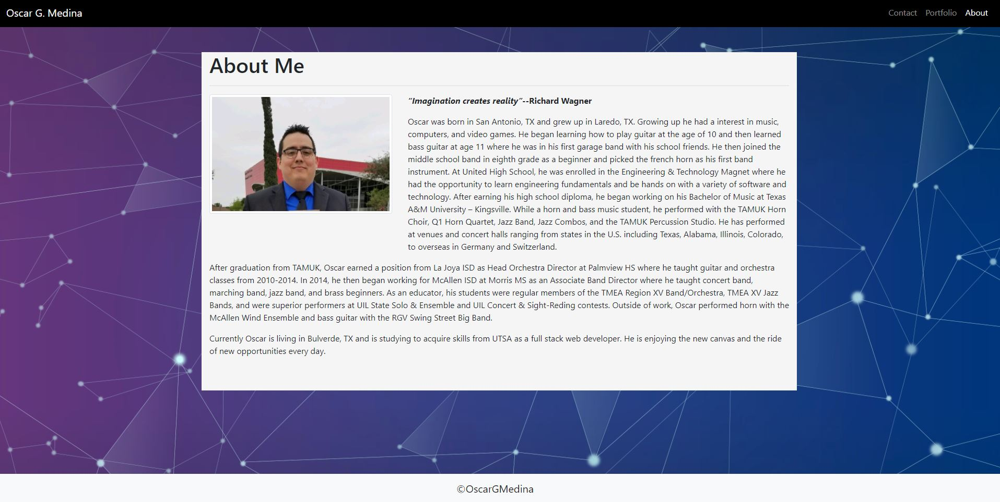

# Homework CSS and Bootstrap: Responsive Portfolio
```
Live Site: https://ogmedina.github.io/Homework-CSS-Bootstrap/index.html
```

## Full Stack Boot Camp Homework 2 - Responsive Portfolio

### Description

This is the second assignment for the UTSA Full-Stack Bootcamp. This is a responsive portfolio. The following items were the highlights of this assignment:

* A navbar

* A responsive layout

* Responsive images

### Screenshots
